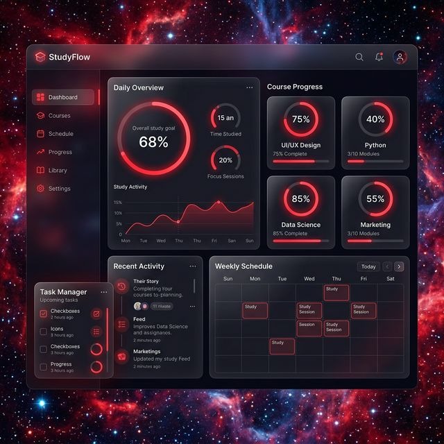

# StudyFlow 🚀

### *The Ultimate Space-Themed Course Planner*

<div align="center">
  
</div>

<br />

StudyFlow is a premium, high-performance learning management tool designed for modern students and lifelong learners. It transforms your study routine into a visually stunning experience with its unique space-themed interface, glassmorphism UI, and smooth animations.

---

## ✨ Key Features

### 🌌 Immersive Space Theme
Experience a cosmic study environment with dynamic nebulas, glowing red accents, and subtle starfield effects that bring your dashboard to life.

### 📋 Course Management
- **Organize Naturally**: Group your learning by course or subject.
- **Custom Thumbnails**: Personalize every course with its own image.
- **Daily Roadmaps**: Break down courses into manageable daily lesson blocks.

### 📈 Progress Tracking
- **Radial Completion Stats**: At-a-glance circular progress indicators for every course.
- **Micro-Progress tracking**: Mark individual lessons as completed and see your percentage climb in real-time.
- **Dynamic Skeletons**: Enjoy seamless transitions with route-specific skeleton loaders that match every page's layout perfectly.

### 🏆 Competition Hub
- **Leaderboards**: Compete with friends or fellow students to see who's leading the study streak.
- **Shared Courses**: Collaborate and track progress together on shared learning paths.

### 🛠️ Developer-Centric Profile
- **Global Settings**: Customize your identity with a variety of futuristic avatars.
- **Social Integration**: Connect with the developer through a modern, glassmorphic space footer.

---

## 🚀 Technical Highlights

- **Next.js 16 (App Router)**: Utilizing React Server Components and optimized routing.
- **Tailwind CSS 4**: Cutting-edge utility-first styling for maximum performance and modern aesthetics.
- **Framer Motion**: Fluid, physics-based animations and transitions throughout the entire UI.
- **Lucide Icons**: Crisp, professional iconography for a premium look and feel.
- **Responsive Design**: Flawless experience across mobile, tablet, and desktop devices.
- **Skeleton Loading**: Precision-engineered placeholders for zero-layout-shift navigation.

---

## 🛠 Getting Started

### Prerequisites

- Node.js 18.x or later
- npm (or your preferred package manager)

### Installation

1. **Clone the repository**
   ```bash
   git clone https://github.com/ahmed-aboalazayem/studyflow.git
   cd studyflow
   ```

2. **Install dependencies**
   ```bash
   npm install
   ```

3. **Database Setup**
   The project uses Prisma ORM. Ensure your environment is ready:
   ```bash
   npx prisma generate
   ```

4. **Run the development server**
   ```bash
   npm run dev
   ```

5. **Open the app**
   Navigate to [http://localhost:3000](http://localhost:3000) to start your journey.

---

## 📖 Project Structure

```text
src/
├── app/            # Next.js App Router (pages, layouts, loaders)
├── components/      # Reusable UI & Layout components
│   ├── ui/         # Base atoms (Button, Input, Card, Modal)
│   ├── layout/     # Header, Footer
│   └── course/     # Specialized educational components
├── lib/            # Shared logic (Prisma, Auth, State Management)
└── public/         # Global assets (Images, Thumbnails)
```

---

## 👨‍💻 Developed By

**Ahmed Aboalazayem**
*Full-Stack Developer & UI/UX Enthusiast*

Feel free to connect or reach out for collaboration!

<div align="center">
  <br />
  <a href="https://linkedin.com/in/ahmed-aboalazayem-664562326"></a>
  &nbsp;&nbsp;
  <a href="https://github.com/ahmed-aboalazayem"></a>
  &nbsp;&nbsp;
  <a href="mailto:ahmedaboalazayem1@gmail.com"></a>
</div>

---

<p align="center">
  <i>"Success is the sum of small efforts, repeated day in and day out."</i>
</p>